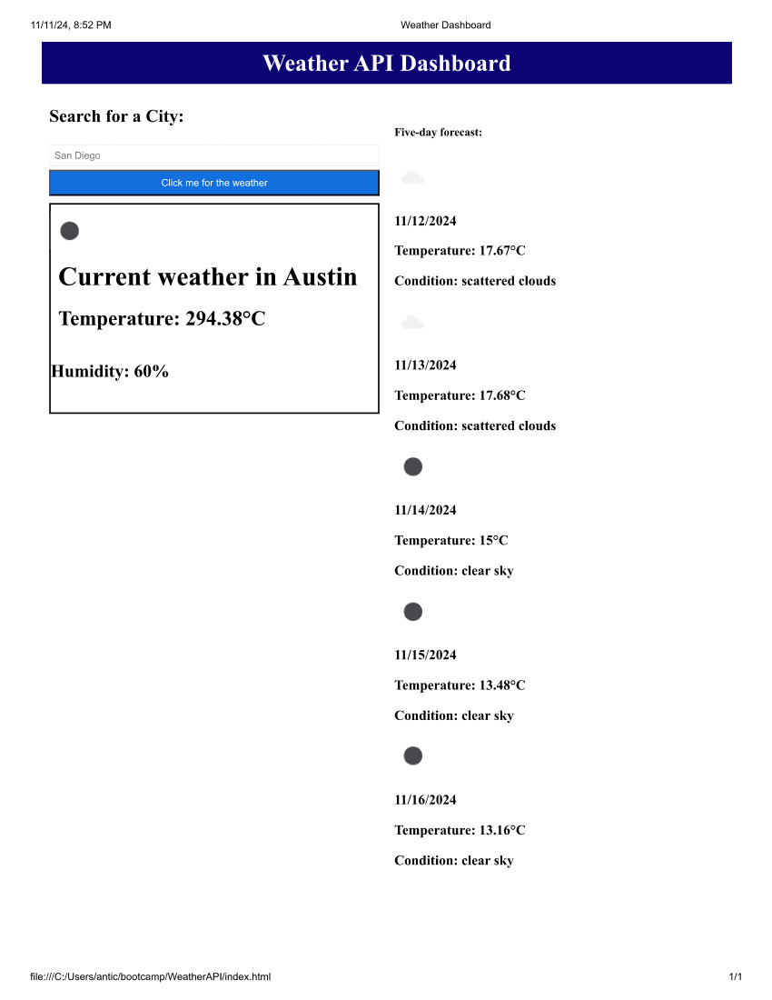

# Weather Application

## Description

The purpose of this application was to create a weather app that uses a Weather API. This app would show the 5 day weather forcast for different cities in the United States.

## Table of Contents

Credits

Developer: Noah McKinzie

Link to Github: https://github.com/nmck-sys/WeatherAPI

Link to website: https://nmck-sys.github.io/WeatherAPI/

